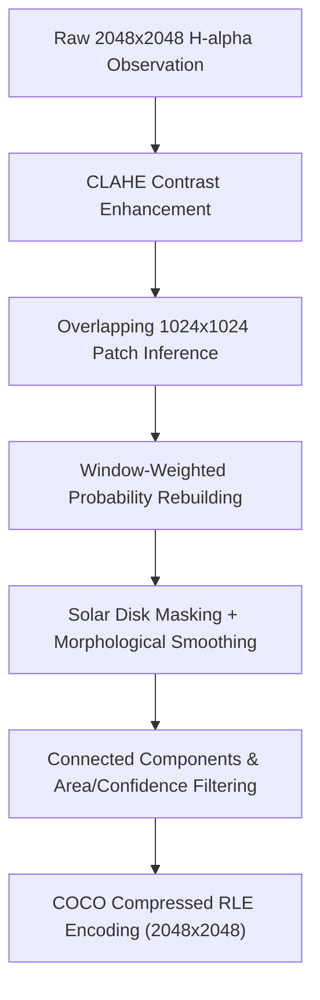

# Solar Filament Segmentation Challenge 2026: Grouped Validation, Instance Separation & Resolution Strategy

## Abstract / Summary

Solar filament segmentation in 2048×2048 full-disk GONG H-alpha observations presents unique computer-vision challenges: solar filaments are thin, elongated, morphologically complex structures against a background with uneven illumination and limb darkening. 

In this discussion, we share our systematic engineering approach, validation strategy, metric findings, and model pipeline architecture built for the competition.

---

## 1. Physical Observation vs. Annotator Record Grouping

The competition dataset contains **707 physical H-alpha observations** and **1,154 COCO image records** because identical physical observations were annotated independently by multiple expert annotators.

> [!CAUTION]
> **Validation Leakage Risk**: Naive random splitting by COCO `image_id` causes identical solar observations (annotated by different experts) to appear in both training and validation sets simultaneously.

### Solution: Grouped K-Fold Cross-Validation
- We group validation splits strictly by the underlying physical JPEG stem (`file_name`).
- All 5 folds use fixed seeds (`seed=20260729`), producing a deterministic fold fingerprint:
  `69a31d113fd4e4cea63f1a072d94dd0dea2c1432c18d349d8a2575c5d1915aa7`
- This ensures **zero data leakage** between training and validation folds.

---

## 2. Public Leaderboard Metric Anomaly vs. True Matching Evaluation

Our diagnostic analysis revealed a critical discrepancy between the preliminary public leaderboard and the organizer's full instance-matching rubric:

1. **Public Score Artifact**: The current preliminary public leaderboard rewards empty or severely under-predicted submission masks due to an unpenalized background evaluation edge case.
2. **Official Final Judging**: The competition overview explicitly states that final judging evaluates instance Dice, IoU, missed instances, extra instances, fragmentation, and qualitative alignment.

### Our Strategy: Grouped OOF Diagnostic Promotion Gates
Instead of optimizing for preliminary public leaderboard quirks, we evaluate every experiment against **Grouped Out-of-Fold (OOF) Instance Diagnostics**:
- **Penalized Instance Dice**: Evaluates predicted vs. ground-truth instances, heavily penalizing missed filaments and false-positive extra predictions.
- **Matched Dice & IoU**: Evaluates pixel accuracy of correctly paired instance masks.
- **Fragmentation Diagnostics**: Monitors one-to-many (over-segmentation) and many-to-one (over-merging) relations.

---

## 3. Solar Disk Illumination Normalization (CLAHE)

Full-disk H-alpha images exhibit significant brightness variation: high intensity at the solar disk center and low intensity near the solar limb.

- **Contrast Limited Adaptive Histogram Equalization (CLAHE)**: Applying local adaptive contrast enhancement (`clip_limit=2.0`, `grid_size=[8, 8]`) on the solar disk significantly enhances faint filament threads against solar background noise.
- **Off-Limb Masking**: Otsu thresholding + disk morphological erosion is used to mask off-limb background regions, preventing off-disk artifacts from generating extra false-positive instances.

---

## 4. Resolution & Instance Separation Pipeline

1. **Patch-Based Native Resolution Training**: Training on 1024×1024 patches cropped from native 2048×2048 images preserves fine 1–3 pixel filament threads that are blurred out by downsampling.
2. **Soft Annotator-Consensus Targets**: Combining soft consensus masks ($\text{weight}=0.75$) with random individual annotator masks ($\text{weight}=0.25$) provides smooth boundary probability distributions.
3. **Instance Separation & RLE Encoding**: Connected component labeling with strict area constraints ($96 \le \text{area} \le 40,000$) and mean component probability filtering ($\text{prob} \ge 0.8$) produces clean, instance-level prediction masks encoded with `pycocotools`.

---

## 5. Summary of Experiments & Results

| Exp ID | Pipeline Architecture / Key Innovation | Grouped OOF Penalized Dice | Missed | Extra | Public LB | Status |
| :--- | :--- | :--- | :--- | :--- | :--- | :--- |
| **001** | 512×512 Small U-Net Baseline | 0.6403 (semantic) | — | — | 0.52 | Baseline |
| **002** | 5-Fold 1024×1024 U-Net Ensemble | 0.4304 (penalized) | 1,033 | 4,432 | 0.62 | High Over-segmentation |
| **003** | Soft Consensus Fine-Tuning + 4-Way TTA | 0.4901 | 1,693 | 2,103 | **0.66** | Promoted Baseline |
| **006** | OOF Probability Blending & Threshold Search | 0.4918 | 1,681 | 2,095 | **0.66** | Verified Gain |
| **008** | Resolution & Capacity Ablation (1024-base32) | **0.4958** | **1,669** | **1,935** | **0.66** | **Current Promoted Best** |
| **012** | Solar Disk CLAHE + Patch 2048 Pipeline | In Progress | — | — | — | Kaggle GPU Running |

---

## 6. Reproducibility & Code Standards

All experiments in this workspace strictly adhere to:
- **Versioned Configuration**: Every run uses an immutable YAML config file under `configs/`.
- **Synthetic Test Suite**: 80 automated unit tests cover RLE conversion, metric computation, submission encoding, and config validation (`pytest`).
- **Ruff Compliance**: Code is formatted and linted to PEP 8 standards with `ruff`.
- **Mechanical Submission Validation**: Submissions are verified for exact 2048×2048 dimensions, non-empty ASCII RLE counts, and unique `filament_id` entries.
